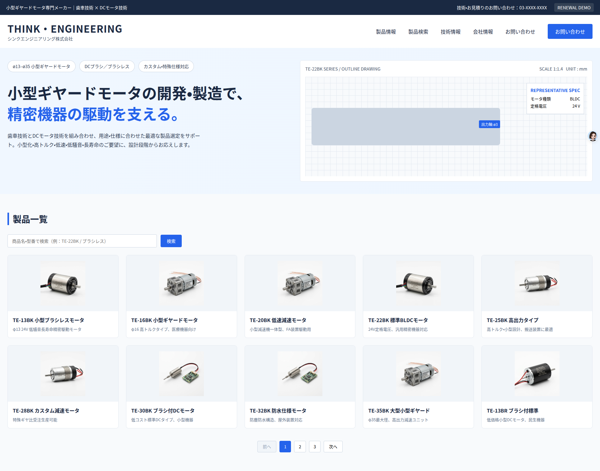
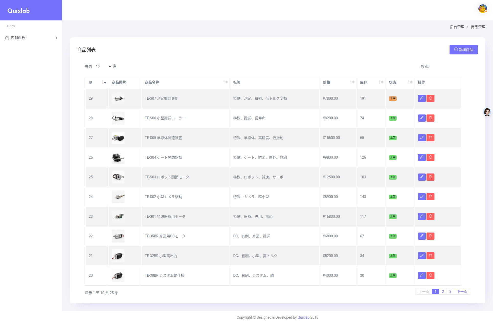
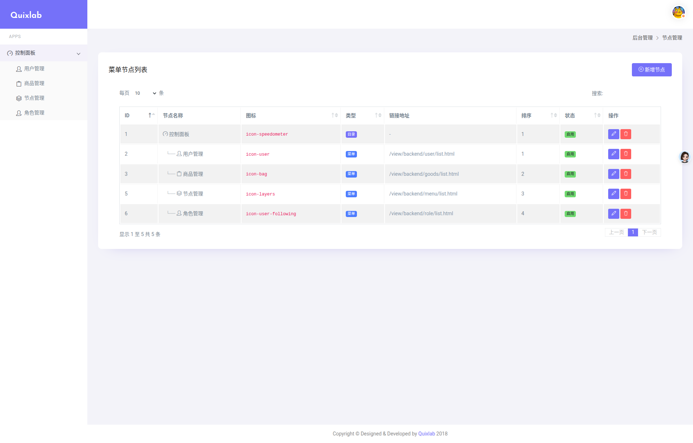
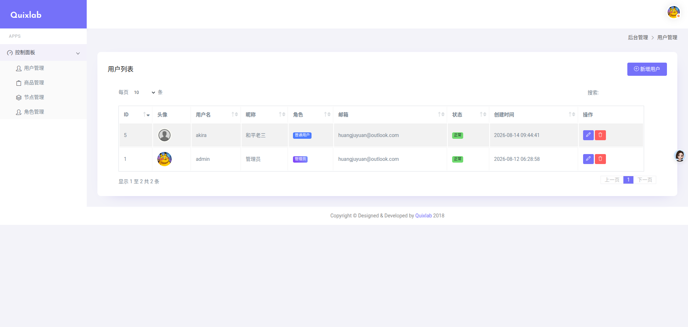

# Think-Engineering 项目文档

`think-engineering` 是一个基于自研 TinyPHP 框架的电商后台管理系统，采用 PHP 8.2 + Apache + MySQL 8 架构，支持 Docker Compose 多容器一键部署。

---

# 第一部分：Docker 部署

## 一、架构说明

项目采用 **Docker Compose 多容器架构**：

| 服务 | 镜像/构建 | 说明 |
|------|----------|------|
| `web` | 本地 `Dockerfile` | PHP 8.2 + Apache 应用容器 |
| `mysql` | 官方 `mysql:8.0` | MySQL 8 数据库容器，宿主机无需安装 |

宿主机无需预装 PHP / MySQL，均由 Docker 管理。

## 二、环境要求

- Docker + Docker Compose（建议 docker-compose ≥ 1.29.2）
- 端口占用：`8080`（web）、`3307`（MySQL）；若被占用可在 `docker-compose.yml` 中修改

## 三、一键部署

```bash
cd /YOUR_FOLDER/think-engineering

# 构建并启动 web + mysql
docker-compose up -d --build
···

## 四、访问地址

| 用途 | 地址 |
|------|------|
| 后台登录 | http://localhost:8080/view/backend/user/login.html |
| 前端商品页 | http://localhost:8080/view/frontend/index.html |
| 登录账号 | admin / 123456 |
| MySQL | `mysql -h127.0.0.1 -P3307 -uroot -proot123456` |
```

## 四、预览

**前端首页**



**后台商品管理**



**后台节点管理**



**后台用户管理**



---

# 第二部分：开发思路

本文梳理项目的整体开发思路、实施步骤及关键注意事项，确保开发过程有序、规范。

## 一、完成 PHP 简易框架 `tinyPHP`

本阶段构建一个轻量级、可扩展的 PHP 基础框架，作为项目的核心支撑。

1. **框架初始化**
   - 搭建基础项目结构，定义入口文件（`index.php`）及自动加载机制。
   - 配置核心组件（路由、请求/响应封装、视图引擎等）。

2. **核心功能实现**
   - 实现 MVC 基础架构，支持控制器、模型、视图的分离与调度。
   - 集成数据库操作类（如 PDO 封装），提供简洁的查询构造器。
   - 添加日志、异常处理及调试工具，便于开发阶段问题定位。

## 二、整体架构目录设计

为保持代码清晰、可维护，项目目录结构规划如下：

```
project-root/
├── config/                 # 配置文件（数据库、路由、应用参数等，支持多环境切换）
├── database/               # 数据库相关代码（迁移脚本等）
├── model/                  # 数据模型层，负责与数据库交互
├── controller/             # 控制器层，接收请求、调用模型、返回响应
├── api/                    # API 接口层，提供 RESTful 风格接口
├── frontend/               # 前端页面代码
├── backend/                # 后台管理页面代码
└── utils/                  # 工具函数集合（验证器、加密类、文件处理等）
```

## 三、功能实现与注意事项

### 1. 搜索功能
- **实现方案**
  - 使用 `tag`，并建立 `tag` 与商品的 `倒排索引`，先从 `tag` 搜索。若未找到再使用 `like` 匹配，尽量避免大规模 `like` 搜索。
- **注意事项**
  - 输入关键词需进行过滤和转义，防止恶意字符破坏查询逻辑。

### 2. 用户登录安全问题
- **实现方案**
  - 使用 `password_hash()` 与加点盐进行密码哈希存储，`password_verify()` 验证登录。
  - 引入 `JWT` 管理用户状态，并设置合理过期时间，从而避免存储 `token`。
- **注意事项**
  - 限制登录失败次数，防止暴力破解。
  - 增加验证码或二次验证（如短信/邮箱）提升安全性。

### 3. SQL 注入问题
- **防护措施**
  - **必须使用**预处理语句（Prepared Statements）或参数化查询，确保 SQL 结构与数据分离。
  - 严格校验输入数据类型（如 `intval()`、`filter_var()`），拒绝异常格式。
  - 不拼接用户输入直接生成 SQL 语句。

### 4. 用户权限与后台功能
- 基于 RBAC 的角色权限模型，`te_user` / `te_role` / `te_menu` / `te_role_menu` 表管理。
- 侧边栏菜单由接口动态渲染，按角色过滤可访问节点。
- JWT 鉴权保护后台接口，禁用用户登录后 token 即时失效。

## 四、部署及其他准备工作

### 1. 搭建 PHP 的 Composer
- **目的**：实现依赖管理与自动加载，为引入第三方库（如日志、ORM、测试框架）做准备。
- **操作步骤**：
  1. 安装 Composer（参考官方指南）。
  2. 初始化 `composer.json`，配置项目依赖和 PSR-4 自动加载规则。
  3. 运行 `composer install` 生成 `vendor` 目录及自动加载文件。

### 2. 搭建 Docker 环境（PHP + Apache + MySQL）
- **目的**：统一开发、测试、生产环境，确保部署一致性（详见第一部分 Docker 部署）。
- **操作步骤**：
  1. 编写 `Dockerfile`，基于官方 PHP-Apache 镜像，配置扩展（如 PDO、MySQLi）。
  2. 定义 `docker-compose.yml`，协调 PHP 容器与 MySQL 等依赖服务。
  3. 映射本地项目目录至容器内，支持代码实时更新。
  4. 启动容器并验证服务运行正常（如访问 `http://localhost:8080`）。
